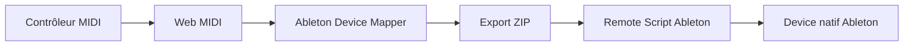

# Ableton Device Mapper

Créer des Remote Scripts Ableton pour contrôler les devices natifs Ableton Live depuis le navigateur.

[English](README.md) · [Installation](docs/ABLETON_INSTALLATION.md) · [Dépannage](docs/TROUBLESHOOTING.md)

## Qu'est-ce qu'Ableton Device Mapper ?

Ableton Device Mapper capture les messages MIDI CC, les associe aux paramètres catalogués des devices natifs de Live, puis exporte un pack Remote Script Python prêt à installer. Tout fonctionne localement dans le navigateur, sans compte ni backend.

Le projet prend en charge des instruments, effets audio et effets MIDI comme Operator, Wavetable, Drift, Simpler, Sampler, Auto Filter, EQ Eight, Roar, Hybrid Reverb, Arpeggiator et Expression Control.

Contrairement à M4L Remote Mapper, aucun patch Max for Live n'est généré ou nécessaire : cette application cible directement les devices natifs.

## Pourquoi ?

Le MIDI Map de Live convient parfaitement aux assignations propres à un Set. Un mapping réutilisable demande toutefois un Remote Script capable de découvrir les devices, résoudre les paramètres, adapter leurs plages et produire des logs utiles. L'application génère ce boilerplate depuis une interface visuelle.

## Fonctionnement



## Fonctionnalités

- Capture Web MIDI CC
- Catalogue Live 12.4.5b6 : 83 devices et 2 746 paramètres
- Filtres par catégorie, device et paramètre
- Paramètres recommandés, sections et risques
- Presets 8 Knobs, 8 Faders, 16 Controls, Operator, Auto Filter et EQ Eight
- Résolution sécurisée par aliases avant l'index
- Scaling MIDI vers `parameter.min` / `parameter.max`
- Fallback par index désactivé par défaut
- `BUILD_ID`, logs Live, Setup Wizard et install checker
- Export ZIP entièrement local
- Layout Builder modulaire avec addition de plusieurs groupes
- Layout Stack réorganisable et MIDI Control Pool intelligent
- Détection des sources/paramètres dupliqués et routes non assignées
- Export/import du profil JSON dans le navigateur
- Scaling MIDI linéaire inversé
- Contrôles Custom Layout animés en temps réel par les valeurs MIDI assignées
- Sélecteur persistant Normal / Terminal Edition partageant les mêmes mappings et exports

## Layout Builder

Un layout est un groupe de mappings. **Add layout** ajoute le groupe à la surface actuelle ; **Replace mapping** remplace uniquement les groupes issus de layouts et conserve les mappings manuels ; **Preview only** affiche le contenu sans modifier la stack.

Chaque élément de la Layout Stack peut être déplacé ou supprimé. Supprimer un layout retire uniquement ses propres mappings. Les routes manuelles restent présentes et toutes les lignes sont éditables.

Le MIDI Control Pool préfère automatiquement un fader, knob ou bouton selon le layout. S'il n'existe plus de contrôle compatible, la ligne reste visible avec **No MIDI source assigned** et peut être complétée avec Learn MIDI.

**Export Profile JSON** sauvegarde le nom du script, le device, la stack, les mappings et le pool. **Import Profile JSON** restaure ce travail dans le navigateur.

### Exemple : layout performance Operator

```text
Operator Musical 8
+ Operator Filter 4
+ Operator Oscillator Levels 4
```

Le bouton **Auto-build best layout** construit cette combinaison automatiquement.

### Exemple : layout personnalisé

```text
Blank Custom 8
+ assignation manuelle des paramètres
```

La page Custom Layout peut afficher la surface hardware normale ou sa version ASCII avec le bouton **UI · NORMAL / TERMINAL**. Changer de style conserve le layout, les sources MIDI apprises, les paramètres assignés et l'état d'export.

## Démarrage rapide

```bash
npm --prefix client install
npm run dev
```

Ouvrir l'URL Vite dans un navigateur Chromium, activer le MIDI, choisir un device natif, appliquer un layout puis exporter le pack.

## Installation dans Ableton

Le ZIP contient uniquement le Remote Script et ses outils :

```text
Ableton_Device_Mapper_Pack/
├── 1_COPY_THIS_FOLDER_TO_REMOTE_SCRIPTS/<scriptSlug>/
├── 2_READ_ME_FIRST.md
├── INSTALL_CHECK.command
└── TROUBLESHOOTING.md
```

Copier seulement `<scriptSlug>/` dans `~/Music/Ableton/User Library/Remote Scripts/`, redémarrer Live, sélectionner la Control Surface et l'entrée MIDI. Output doit rester sur `None`.

## Choisir et mapper un device natif

Filtrer par instrument, effet audio ou effet MIDI. Le script mémorise le nom visible et la classe Live, puis cherche sur la piste sélectionnée, toutes les pistes, les retours, Master et les racks imbriqués.

Chaque paramètre est cherché par alias exact puis normalisé. Garder **Allow index fallback if name is missing** désactivé sauf nécessité explicite.

## Custom MIDI Layout Designer

Vous pouvez créer votre propre layout MIDI en choisissant le nombre de faders, knobs et boutons. L’application génère une visualisation du contrôleur, permet d’apprendre chaque contrôle MIDI, puis de le mapper vers les paramètres du device Ableton.

Par exemple, créer **2 faders + 3 knobs + 1 bouton**. Chaque module apparaît sur la face avant virtuelle avec son CC MIDI, son paramètre cible et ses warnings. Un clic permet de le renommer, changer son type, apprendre ou retirer le MIDI, choisir sa cible, régler son mode bouton ou son scaling, et le supprimer. D’autres contrôles peuvent être ajoutés après la création.

Les layouts custom sont stockés avec `controllerLayoutType: "custom_grid"` dans le Profile JSON. L’import restaure la visualisation, les labels, assignations, modes bouton, réglages de scaling, le Layout Stack et le MIDI Control Pool. Les presets restent disponibles dans l’onglet secondaire **Preset Layouts / Advanced**.

## Mappings de boutons

Ableton Device Mapper peut mapper des boutons MIDI vers les paramètres natifs comme Device On, les switches, toggles, modes Sync et autres contrôles on/off. Choisir **Button** comme type de contrôle, puis un mode :

### Momentary

Le paramètre reste actif tant que le bouton est maintenu, puis se désactive au relâchement.

### Input toggle

Le paramètre suit la valeur envoyée par le contrôleur : toute valeur positive active, zéro désactive.

### Script toggle

Chaque appui à `127` inverse l'état du paramètre ; le relâchement est ignoré. C'est le mode recommandé pour faire latcher un bouton MIDI momentané.

### Trigger

Un appui à `127` exécute une impulsion max puis min. Ce mode convient aux actions ponctuelles et à Capture MIDI lorsqu'un mapper expose cette action globale.

Exemple nanoKONTROL2 :

- bouton S → Device On
- bouton M → Filter On
- bouton R → LFO On
- bouton Transport → Capture MIDI (dans un mapper exposant cette action globale)

Les layouts de boutons préfèrent les contrôles libres classés `button` dans le MIDI Control Pool. Sans bouton libre, la route reste non assignée au lieu de prendre un knob ou un fader.

## Nommer son script

Avant l'export, choisir un **Nom du script** descriptif. Il devient l'identité de la Control Surface pendant l'installation, tandis que le générateur produit automatiquement des identifiants compatibles :

```text
Operator NanoKontrol Remote
→ dossier/fichier : Operator_NanoKontrol_Remote
→ classe Python : OperatorNanoKontrolRemote
```

Les espaces, accents et signes de ponctuation sont convertis. Un nom commençant par un chiffre reçoit le préfixe `Script`. Préférer la formule **Device + Contrôleur + Remote** à un nom générique comme `test` :

- `Operator NanoKontrol Remote`
- `Drift BeatStep Remote`
- `Auto Filter LaunchControl XL Remote`

Réutiliser le même nom remplace l'ancien dossier après réinstallation. Le nom participe aussi au `BUILD_ID` déterministe.

## Scaling MIDI

```text
MIDI 0–127 → normalisation 0.0–1.0 → parameter.min–parameter.max
```

L'option **Invert MIDI** inverse la plage : MIDI 0 devient le maximum et MIDI 127 le minimum. Le profil conserve `curve: "linear"` pour permettre de futures courbes sans complexifier cette version.

## Démo Operator connue-bonne

| CC | Paramètre |
| ---: | --- |
| 16 | Volume |
| 17 | Tone |
| 18 | Filter Freq |
| 19 | Filter Res |
| 20–23 | Osc-A à Osc-D Level |

## Dépannage

- Device absent : charger le device et sélectionner sa piste.
- Paramètre absent : comparer `profile.json` et `available parameters` dans Log.txt.
- Mauvais paramètre : désactiver le fallback, supprimer les anciens dossiers et vérifier `BUILD_ID`.
- Rien ne bouge : vérifier Control Surface, Input, redémarrage et `__pycache__`.

Voir [le guide de dépannage](docs/TROUBLESHOOTING.md).

## Développement

```bash
npm test
npm --prefix client run build
```

## Limites et roadmap

Le navigateur ne peut pas installer le script directement, Live doit redémarrer, Web MIDI dépend du navigateur et le catalogue correspond à Live 12.4.5b6. La roadmap prévoit davantage de layouts musicaux, de templates contrôleurs, l'import/export de presets et davantage d'actions Live.

## Licence

Publié sous [licence MIT](LICENSE). Ce projet indépendant n'est ni affilié ni approuvé par Ableton.
