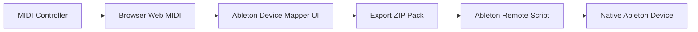

# Ableton Device Mapper

Create installable Ableton Remote Scripts for native Ableton Live devices from your browser.

[](https://react.dev/)
[](https://vite.dev/)
[](https://www.ableton.com/live/)
[](https://developer.mozilla.org/docs/Web/API/Web_MIDI_API)
[](tests/)
[](LICENSE)

[Français](README.fr.md) · [Installation](docs/ABLETON_INSTALLATION.md) · [Troubleshooting](docs/TROUBLESHOOTING.md) · [Development](docs/DEVELOPMENT.md)

## What is Ableton Device Mapper?

Ableton Device Mapper captures MIDI CC messages, maps them to catalogued parameters on native Ableton Live devices, and exports a Python MIDI Remote Script pack. It runs locally in the browser with no account, backend, or MIDI upload.

It supports instruments, audio effects, and MIDI effects including Operator, Wavetable, Drift, Simpler, Sampler, Auto Filter, EQ Eight, Roar, Hybrid Reverb, Arpeggiator, and Expression Control.

This project controls native Live devices. It does not generate or require a Max for Live patch. For custom Max devices, use the companion M4L Remote Mapper project.

## Why?

Live's MIDI Map is excellent for Set-specific assignments, while reusable controller integrations require Remote Scripts. Writing those scripts manually means handling MIDI forwarding, device discovery, parameter names, value ranges, installation, and debugging. Ableton Device Mapper generates that boilerplate from a visual mapping.

## How it works



## Features

- Web MIDI CC capture
- Live 12.4.5b6 catalog: 83 devices and 2,746 parameters
- Category and device search
- Parameter search, sections, risk, and recommendations
- 8 Knobs, 8 Faders, 16 Controls, Operator, Auto Filter, EQ Eight, and blank presets
- Alias-first native device and parameter discovery
- MIDI 0–127 scaling through `parameter.min` / `parameter.max`
- Advanced index fallback disabled by default
- Generated `BUILD_ID` and focused Live logs
- `EncoderElement` with `add_value_listener`
- Browser-side ZIP export, setup wizard, install checker, and troubleshooting

## Quick Start

```bash
npm --prefix client install
npm run dev
```

Open the Vite URL in a Chromium-based browser, enable MIDI, select a controller, choose a native device, apply or build a layout, and export the pack.

## Ableton Installation

The ZIP contains:

```text
Ableton_Device_Mapper_Pack/
├── 1_COPY_THIS_FOLDER_TO_REMOTE_SCRIPTS/
│   └── <scriptSlug>/
│       ├── __init__.py
│       ├── <scriptSlug>.py
│       └── profile.json
├── 2_READ_ME_FIRST.md
├── INSTALL_CHECK.command
└── TROUBLESHOOTING.md
```

Copy only `<scriptSlug>/` into `~/Music/Ableton/User Library/Remote Scripts/`, restart Live, then select the generated Control Surface and your controller Input. Set Output to `None`.

See [Ableton installation](docs/ABLETON_INSTALLATION.md).

## Choosing a native Ableton device

Filter by instrument, audio effect, or MIDI effect, then search by visible device name. The generator stores both the visible name and Live class name. At runtime it searches the selected track first, then all tracks, returns, master, and nested racks.

## Mapping MIDI controls to device parameters

Each route contains its MIDI endpoint, channel and CC, target device aliases, parameter aliases, catalog indices, section, and fallback policy. Parameters resolve by exact and normalized aliases before any index is considered.

Keep **Allow index fallback if name is missing** disabled unless name matching is impossible. Native parameter order can change between devices or Live versions.

## Naming your script

Before export, choose a descriptive **Script name**. It becomes the Control Surface identity shown during installation, while the generator creates compatible identifiers for Ableton and Python:

```text
Operator NanoKontrol Remote
→ folder/file: Operator_NanoKontrol_Remote
→ Python class: OperatorNanoKontrolRemote
```

Spaces, punctuation, and accents are converted safely. Names beginning with a number receive a `Script` prefix. Prefer **Device + Controller + Remote** over generic names such as `test`:

- `Operator NanoKontrol Remote`
- `Drift BeatStep Remote`
- `Auto Filter LaunchControl XL Remote`

Reusing a name replaces the previous installed folder after a clean reinstall. The script name is included in the deterministic `BUILD_ID`, so differently named scripts with identical mappings remain distinguishable in Log.txt.

## MIDI value scaling

```text
MIDI 0–127 → normalized 0.0–1.0 → parameter.min–parameter.max
```

The script writes the target's actual Live value instead of blindly writing 0–127.

## Known-good Operator demo

The Operator Musical 8 preset uses MIDI channel 1:

| CC | Parameter |
| ---: | --- |
| 16 | Volume |
| 17 | Tone |
| 18 | Filter Freq |
| 19 | Filter Res |
| 20 | Osc-A Level |
| 21 | Osc-B Level |
| 22 | Osc-C Level |
| 23 | Osc-D Level |

## Troubleshooting

- **Device not found:** load the device, select its track, and check whether it was renamed.
- **Parameter not found:** compare `profile.json` with `available parameters` in Log.txt.
- **Wrong parameter moves:** disable index fallback, remove old folders, and verify `BUILD_ID`.
- **Nothing moves:** check Control Surface, MIDI Input, restart Live, and remove `__pycache__`.

See [Troubleshooting](docs/TROUBLESHOOTING.md).

## Log debugging

```bash
grep -R "Ableton Device Mapper\|BUILD_ID\|device not found\|target device found\|parameter found\|parameter missing\|available parameters\|parameter updated" \
"$HOME/Library/Preferences/Ableton/Live 12.4.5b6/Log.txt" | tail -n 180
```

## Clean reinstall

Quit Live, inspect the slug, then run:

```bash
rm -rf "$HOME/Music/Ableton/User Library/Remote Scripts/<scriptSlug>"
find "$HOME/Music/Ableton/User Library/Remote Scripts" -name "__pycache__" -type d -prune -exec rm -rf {} +
```

Copy one fresh folder and restart Live.

## Development

```bash
npm test
npm --prefix client run build
```

See [Development](docs/DEVELOPMENT.md).

## Project structure

```text
client/   React/Vite application, catalog, and generators
docs/     Installation, architecture, and troubleshooting
tests/    Catalog, Python, ZIP, and safety tests
```

## Roadmap

- More musical device-specific layouts
- Controller templates for Launch Control XL and MIDImix
- Mapping preset import/export
- Discrete/button parameter modes
- Additional Live global actions
- Deployment presets for GitHub Pages and Vercel

## Limitations

- Browsers cannot install directly into Live's Remote Scripts folder.
- Live must restart after installing or replacing a Remote Script.
- Web MIDI support depends on the browser; Chromium is the primary target.
- The catalog reflects Live 12.4.5b6 and may differ from other Live versions or editions.
- The current workflow is tested primarily on macOS and nanoKONTROL2.
- Ableton's Remote Script API is not a stable public API.

## License

Released under the [MIT License](LICENSE).

Ableton and Ableton Live are trademarks of their respective owners. This independent project is not affiliated with or endorsed by Ableton.
